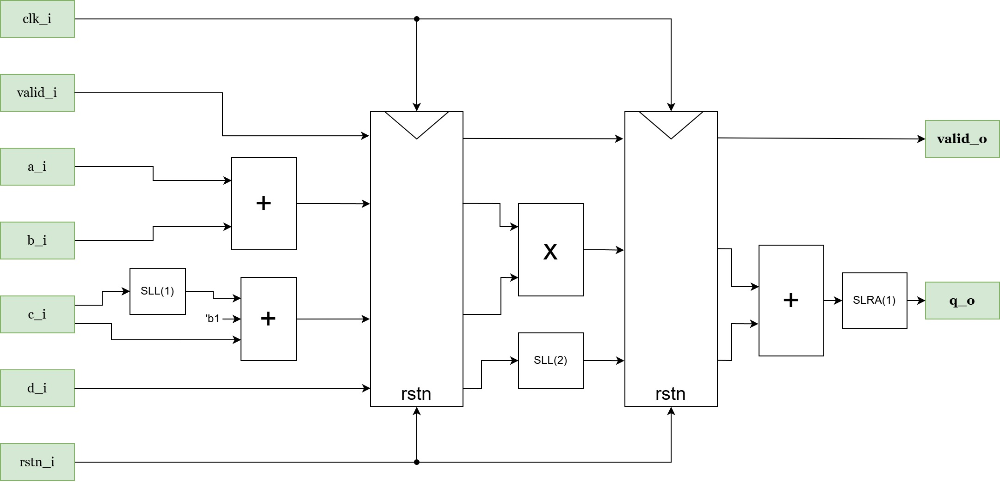
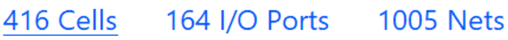
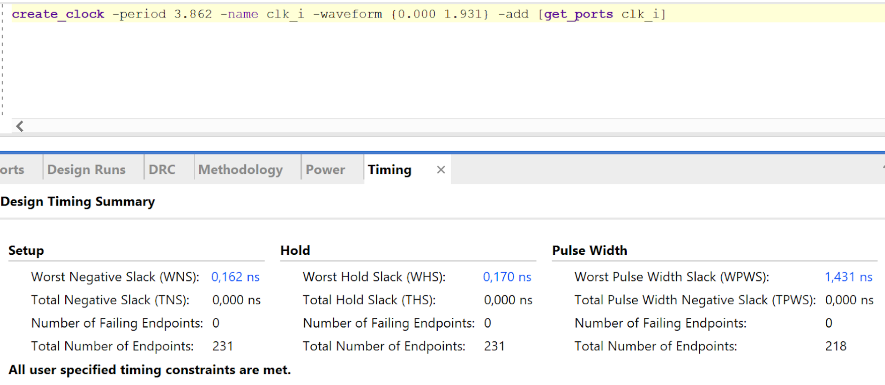

## 1. 
Схематически изобразил основную логику модуля, абстрагировавшись от вспомогательной:

## 2. 
Описанный на SV модуль называется exs_of.sv
“латентность схемы должна быть оптимальной” - как я понял, оптимальной
может быть латентность от 2 до 4. Я реализовал конвейер с тремя стадиями.
Если бы я точно знал, под что пишу, мог бы попробовать оптимизировать через
примитивы, но за неимением этого знания отдаю на откуп синтезатору.
Критический путь должен быть на второй стадии.
Реализовано подтверждение данных при помощи сигнала valid_i. Он
передаётся по конвейеру, обнуляясь в случае переполнения. Если данные не
валидны, вычисления с ними всё равно будут производиться. Задания
экономить энергопотребление не было; намёк на площадь был.
## 9. 
Описанный на SV tb-модуль называется exs_of_tb.sv
На мой взгляд он работает корректно.
Полная гарантия отсутствия переполнений будет при DATA_WIDTH = 66.
## 10. 
Скрипт на Python называется exs.py
## 12. 
Оценил аппаратный ресурс на Artix 7:

При отсутствии валидации выходных данных он может быть меньше.
## 13. 
По моим оценкам, максимальная тактовая частота = 1/3.862 нс, т.е. около
258 МГц

## 11. Возможные способы защиты от ошибок переполнения разрядной сетки.
### 1.1 
Ограничение на величину входных данных. Для минимизации риска
переполнения:
модуль разности a и b должен быть минимальным
модуль величины c должен быть минимальным
### 1.2 
Ограничение на разрядность входных данных до (DATA_WIDTH-2)//2
гарантирует, что ответ уместится в исходную разрядность.
### 2. 
Увеличить разрядность регистров. Повышение разрядности выходных
данных до 2*DATA_WIDTH+2 гарантированно позволит сохранять ответ.
Спасибо за уделённое время)